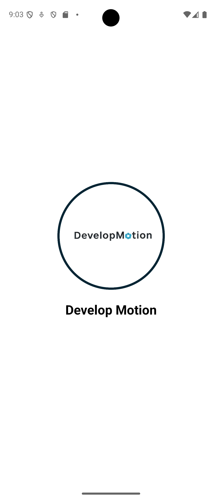
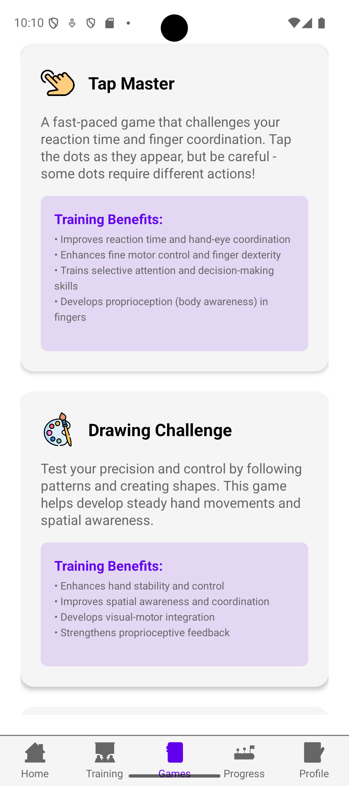
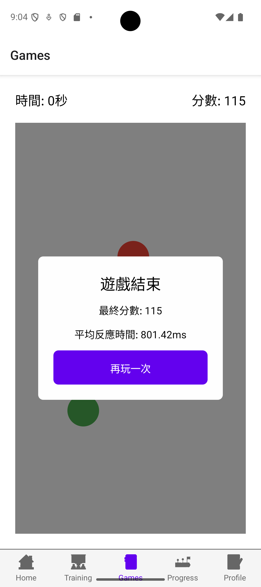
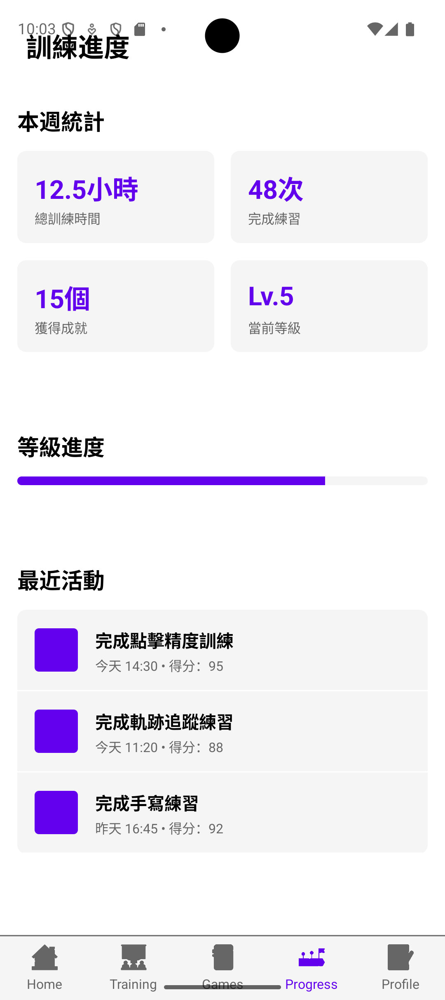

# Fine Motor Training App

A React Native application designed to improve fine motor skills, hand-eye coordination, and proprioception through engaging games and exercises.

## Features

### 1. Multi-language Support 
- English
- Traditional Chinese
- Simplified Chinese
- Spanish
- Dynamic language switching
- Persistent language preferences

### 2. Training Modules
- Click Accuracy Training
- Track Following Exercises
- Handwriting Practice
- Multiple difficulty levels
- Progress tracking

### 3. Games
- Interactive games for skill development
- Real-time feedback
- Performance metrics
- Achievement system

### 4. Progress Tracking
- Detailed performance analytics
- Visual progress charts
- Achievement tracking
- Training history

### 5. User Profile
- Personal information management
- Language preferences
- Theme settings
- Notification preferences

## Screenshots

<div style="display: flex; justify-content: space-between; margin: 20px 0;">
  
  
</div>
<div style="display: flex; justify-content: space-between; margin: 20px 0;">
  
  
</div>

## Getting Started

### Prerequisites

- Node.js (v18 or later)
- npm or yarn
- React Native CLI
- Android Studio (for Android development)
- Xcode (for iOS development, macOS only)

### Installation

1. Clone the repository:

```bash
git clone [repository-url]
cd ReactNativeApp
```

2. Install dependencies:

```bash
npm install
# or
yarn install
```

3. Start the Metro bundler:

```bash
npx react-native start
```

4. Run the application:

```bash
# For Android
npx react-native run-android

# For iOS
npx react-native run-ios
```

## Development

### Project Structure

```
src/
  ├── assets/         # Images and other static assets
  ├── components/     # Reusable UI components
  │   ├── TabBar.tsx  # Custom bottom tab navigation
  │   ├── LanguageSelector.tsx  # Language switching component
  │   └── ...
  ├── contexts/       # React Context providers
  │   ├── LanguageContext.tsx  # Language management
  │   └── ...
  ├── screens/        # Screen components
  │   ├── HomeScreen.tsx
  │   ├── TrainingScreen.tsx
  │   ├── GamesScreen.tsx
  │   ├── ProgressScreen.tsx
  │   └── ProfileScreen.tsx
  ├── i18n/          # Internationalization
  │   ├── locales/   # Translation files
  │   └── index.ts   # i18n configuration
  ├── theme/         # Theme configuration
  │   ├── colors.ts
  │   ├── typography.ts
  │   └── index.ts
  └── utils/         # Utility functions
```

### Key Technologies

- React Native 0.78.2
- TypeScript 5.0.4
- React 19.0.0
- Styled Components 6.1.17
- React Navigation 7.x
- i18next 24.2.3
- React Native Reanimated 3.17.2
- React Native Gesture Handler 2.25.0

### Dependencies

The project uses the following major dependencies:

```json
{
  "dependencies": {
    "@react-native-async-storage/async-storage": "^2.1.2",
    "@react-navigation/bottom-tabs": "^7.3.8",
    "@react-navigation/native": "^7.1.4",
    "i18next": "^24.2.3",
    "react-i18next": "^15.4.1",
    "react-native": "0.78.2",
    "react-native-gesture-handler": "^2.25.0",
    "react-native-reanimated": "^3.17.2",
    "styled-components": "^6.1.17"
  }
}
```

## Contributing

1. Fork the repository
2. Create your feature branch (`git checkout -b feature/amazing-feature`)
3. Commit your changes (`git commit -m 'Add some amazing feature'`)
4. Push to the branch (`git push origin feature/amazing-feature`)
5. Open a Pull Request

## License

This project is licensed under the MIT License - see the LICENSE file for details.
